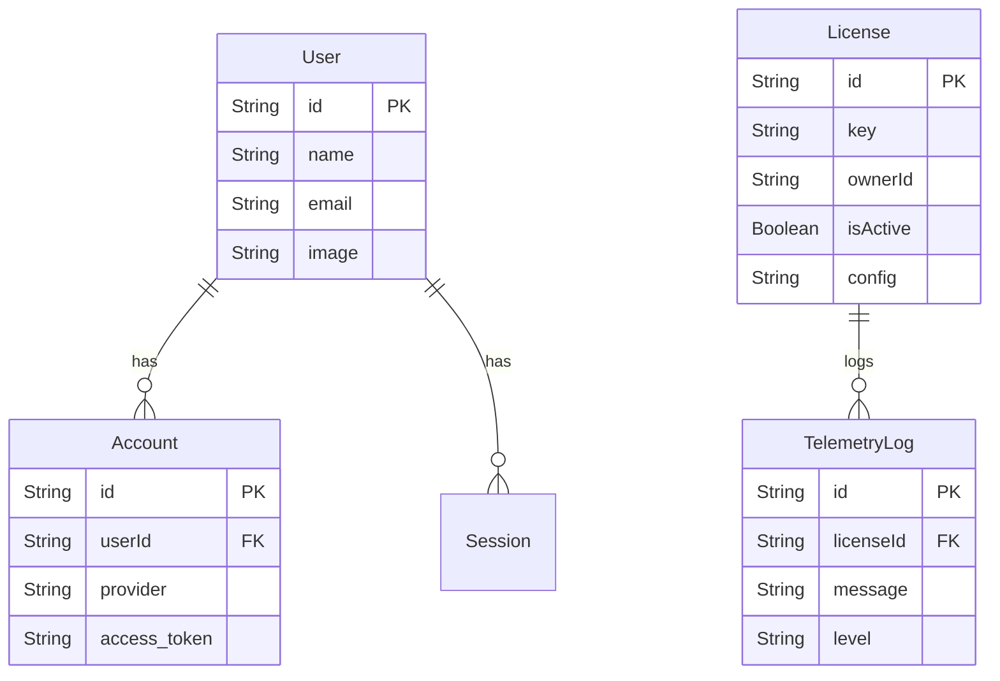

# Database Schema

The project uses **Prisma ORM** with a MySQL database. The schema is defined in `src/prisma/schema.prisma`.

## Core Models

### Authentication (NextAuth)
These models are standard for the NextAuth Prisma Adapter and handle user sessions.

*   **User**: Represents a Discord user who has logged in.
    *   `id`, `name`, `email`, `image`, `emailVerified`.
*   **Account**: Links a `User` to an OAuth provider (Discord).
    *   Stores `access_token`, `refresh_token`, `expires_at`.
*   **Session**: Tracks active user login sessions.
    *   `sessionToken`, `userId`, `expires`.
*   **VerificationToken**: (Optional) Used for passwordless email login flows (typically unused with Discord OAuth).

### Analytics & features

*   **Visitor**: Tracks usage analytics.
    *   `ip`: Visitor IP address.
    *   `visits`: Count of visits.
    *   `lastVisit`: Timestamp of last activity.

*   **License**: Manages product licensing for the bot/dashboard.
    *   `key`: Unique license key.
    *   `ownerId`: Discord ID of the license owner.
    *   `isActive`: Boolean status.
    *   `config`: JSON string storing license-specific config (LongText).
    *   `hwid`: Hardware ID associated with the license.
    *   Relationships: Has many `TelemetryLog`.

*   **TelemetryLog**: Logs events related to license usage.
    *   `level`: Log level (info, warning, etc.).
    *   `message`: Log message content.
    *   `metadata`: Additional context (JSON).

## Schema Diagram

